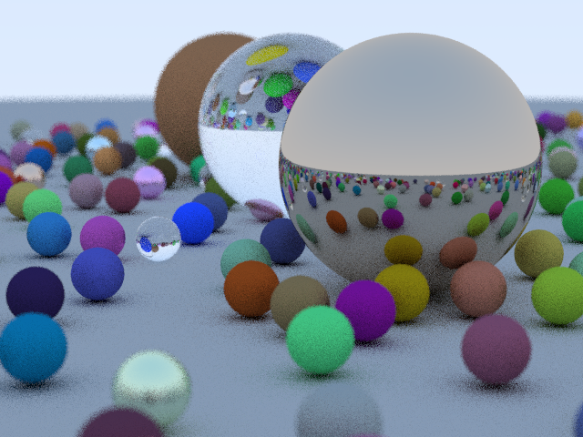

Intro
-----

This is (yet another) variant on Peter Shirley's Ray Tracing in One Weekend
scene. It's in C++, but written in what I'd call "modern game C++" (ahem). There
are no particular optimisations beyond paying a bit of attention to data layout.
Many of the other variants of this code out there are quite OO-heavy, so I
thought it might be of interest to put up some code with this approach as a
comparison. I personally find it easier to understand and work with.

Notes
-----

The first file, [rt1.cpp](rt1.cpp), is a vanilla implementation of classic
recursive ray tracing. Each pixel is calculated independently, and written out
in turn, as in Peter's original. It uses simple arrays to track the scene
geometry and material data, rather than an OO hierarchy.

The second file, [rt2.cpp](rt2.cpp), is a reworked version that replaces the
recursion with the idea of batching similar operations. Instead of working pixel
by pixel, and using a recursive trace function, we generate all camera rays up
front, and then treat each "bounce" of rays as a successive batch. For each
batch we generate all intersections, then for those intersections we generate
shading info, and secondary rays. Intersections are binned per material type so
each material type can be processed in turn. Rays keep track of their
originating pixel, so when they hit a light source they can accumulate the
results back to that pixel.

This sounds complicated, but if you have a look at the code, it's not really. In
fact I would claim rt2.cpp is as straight-forward as rt1.cpp, it's just using a
different approach to organisation.

This code is closer to how a production ray tracer works. Because there is so
much data to deal with (rays, scene geometry, textures), and because coherency
in accessing all that data is so important with large scenes, it makes sense to
split things up so you're processing independent homogeneous chunks of data as
much as possible, instead of mixing everything up in one operation.

In particular, one of the things you should get from looking at the second
version is how much easier this approach is to parallelise. It would be trivial
to farm off batches of ray intersections to different jobs. You could also split
the scene up into independent parts, feeding the results from those parts back
into the hit queue. The different material types could also be processed in
parallel, and/or further split up. Finally, you'd want to bin the initial rays
into successive tiles, so that the writes from terminating rays were more
coherent.

Another obvious thing to do is to roughly sort by ray weights on each pass, so
as to prioritise rays that will potentially make a larger contribution to the
final image. If you have a bound on emitted illumination, you can also start
dropping rays that won't contribute more than some epsilon to the final image.

Of course, the first thing you'd want to do before any of this is add a spatial
data structure for Intersect(). Even here, though, you can think about how you
might sort the rays to ensure queries against your structure are as coherent as
possible.

Building and Running
--------------------

The files require C++14 to run, ironically mostly so I could write C-struct-like
initialisation easily, without having to add a lot of constructor boiler-plate.
They can be compiled and run on Linux or OSX as follows:

    c++ --std=c++14 -O3 -ffast-math rt1.cpp -o rt1
    ./rt1 640 480 4 > rt1.ppm
    c++ --std=c++14 -O3 -ffast-math rt2.cpp -o rt2
    ./rt2 640 480 4 > rt2.ppm

Or more generally as

    ./rt[12] <width> <height> <samples> <maxDepth>

For Windows, add to your favourite IDE.
